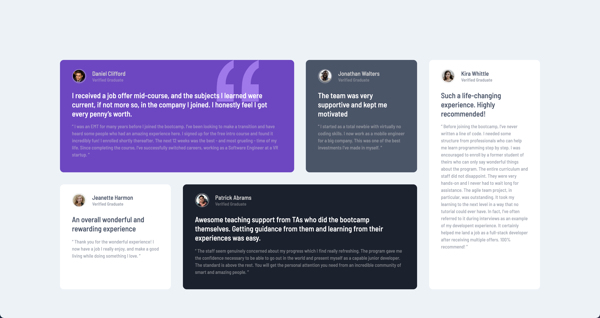

# Frontend Mentor - Testimonials grid section solution

This is a solution to the [Testimonials grid section challenge on Frontend Mentor](https://www.frontendmentor.io/challenges/testimonials-grid-section-Nnw6J7Un7). Frontend Mentor challenges help you improve your coding skills by building realistic projects.

## Table of contents

- [Overview](#overview)
  - [The challenge](#the-challenge)
  - [Screenshot](#screenshot)
  - [Links](#links)
- [My process](#my-process)
  - [Built with](#built-with)
  - [What I learned](#what-i-learned)
- [Author](#author)

## Overview

This challenge is to build out a testimonials grid section and to get it looking as close to the given design as possible.

### The challenge

Users should be able to:

- View the optimal layout for the site depending on their device's screen size

### Screenshot

### Links

- Github Repo: [Github](https://github.com/Oculareo/Testimonials-grid-section)
- Solution URL: [Solution on Frontend Mentor](https://www.frontendmentor.io/solutions/css-grid-for-layout-NnbUQjMBo)
- Live Site URL: [Solution on Vercel](https://testimonials-grid-section-rosy.vercel.app/)

## My process

### Built with

- Semantic HTML5 markup
- CSS Grid
- Mobile-first workflow

### What I learned

I got to practice and reinforce CSS Grid layouts and separate content from presentation by moving cards around the screen without changing the order of HTML.

**Note: Delete this note and the content within this section and replace with your own learnings.**

## Author

- Frontend Mentor - [@Oculareo](https://www.frontendmentor.io/profile/Oculareo)
- Twitter - [@oculareo](https://www.twitter.com/Oculareo)
